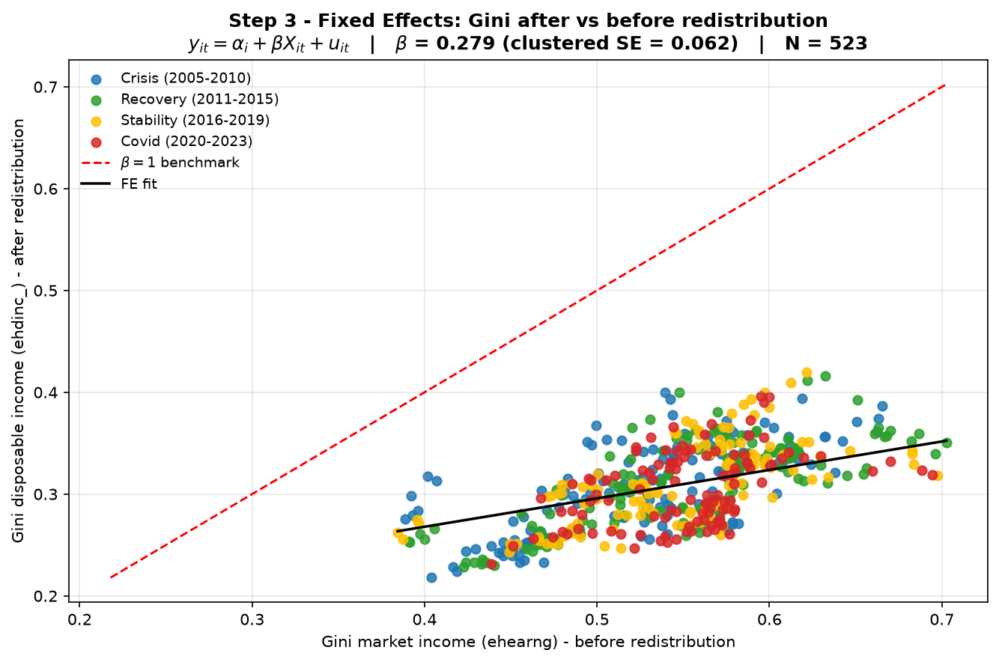

# Hard Left vs. Social Democrats: The Limits of Redistribution

*Can the welfare state undo market-income inequality?* An econometric study of
fiscal redistribution across **32 European countries, 2005–2023** (EU-SILC Gini
data, N = 523 country-year observations).

## The question

Two political-economy traditions make opposing empirical claims:

- **Hard Left** — inequality is rooted in labour markets and earnings; no fiscal
  system can fully compensate for what is determined upstream.
- **Social Democrat** — a well-designed welfare state (transfers + progressive
  taxation) can decisively compress disposable-income inequality even when
  market inequality is high.

We test them with a bivariate *pass-through* regression:

```
Gini_after(i,t) = α + β · Gini_before(i,t) + ε(i,t)
```

β is the share of market-income inequality that **survives** into disposable
income after redistribution. β ≈ 1 → redistribution is powerless; β ≈ 0 →
redistribution is near-total.

## Design

Three model specifications, each estimated with three estimators:

| Model | Specification         | Reads as                                             |
|-------|-----------------------|------------------------------------------------------|
| **A** | `ehdinc_ ~ earng`     | Hard Left — earnings inequality → disposable income  |
| **B** | `ehdinc_ ~ ehearng`   | Social Democrat (main) — full fiscal system          |
| **C** | `ehginc ~ ehearng`    | Transfers only (spending side, before taxes)         |

- **Pooled OLS** — all 523 observations jointly (HC3-robust SE). Baseline.
- **Between** — regression on the 32 country time-averages. Structural, long-run,
  descriptive cross-country pattern.
- **Within FE** — country-demeaned data, country-clustered SE. **Main
  specification**: short-run within-country fiscal responsiveness.

The move to fixed effects + clustered SE is motivated by formal diagnostics:
Breusch-Pagan finds no serious heteroskedasticity (A, B), while Breusch-Godfrey
strongly confirms serial autocorrelation in all models (Gini is persistent).

## Key results

β falls systematically from Pooled OLS → Between → Within FE in every model:

| Model                    | Pooled OLS | Between | Within FE | SE (clust.) |
|--------------------------|-----------:|--------:|----------:|------------:|
| A: `ehdinc_ ~ earng`     |   0.571 | 0.585 | **0.461** |      0.074 |
| B: `ehdinc_ ~ ehearng`   |   0.428 | 0.442 | **0.279** |      0.062 |
| C: `ehginc ~ ehearng`    |   0.529 | 0.556 | **0.310** |      0.062 |

<sub>*** p < 0.001 under country-clustered SE. Between: N = 32. Within FE: N = 523.</sub>

- **Within FE (Model B):** the fiscal system absorbs **72%** of a cyclical
  market-income shock — a powerful short-run stabiliser. Comparing B and C,
  **transfers do the work** (69 pp) and taxation adds only ~3 pp.
- **Between (Model B):** 44% of the *structural* gap between countries survives
  into disposable income — the welfare state is a limited structural equaliser.
- **Reaction model** (`reduc_public ~ ehearng`, between): β = 0.558 — countries
  redistribute more where inequality is greater, but not enough to close gaps.
- **Rank-preservation test** rejects H₀: β = 1 for B and C (t ≈ −11.7, −11.1) —
  redistribution actively **reorders** countries, it does not merely rescale.



**Conclusion.** Both traditions are right, about different horizons: the Social
Democrat in the *short run* (redistribution absorbs cyclical shocks, mainly via
transfers), the Hard Left in the *long run* (structural earnings gaps persist).
Redistribution alone is insufficient to close structural inequality — upstream
interventions in wage formation and labour-market institutions are necessary
complements.

## Repository structure

```
gini-inequality/
├── data/
├── src/                     # Python analysis pipeline
│   ├── config.py            # paths, regions, colours, model specs
│   ├── data_prep.py         # load + reshape long → wide, build analysis frames
│   ├── models.py            # pooled OLS, between, within FE, reaction, rank test
│   ├── diagnostics.py       # Breusch-Pagan, Breusch-Godfrey
│   ├── plots.py             # the two figures
│   └── main.py              # end-to-end pipeline (entry point)
├── results/                 # generated outputs (git-ignored)
│   ├── figures/             # fig1_pooled_ols.png, fig2_fixed_effects.png
│   └── tables/              # summary + diagnostics + intermediate CSVs
├── assets/                  # figures embedded in this README
├── legacy_R/
│   └── inequality_analysis_send.R   # original R script (reference implementation)
├── environment.yml          # conda environment
└── requirements.txt         # pip dependencies
```

## Reproduce

Using **conda** (recommended):

```bash
conda env create -f environment.yml
conda activate gini-inequality
python -m src.main
```

Or with **pip**:

```bash
pip install -r requirements.txt
python -m src.main
```

This regenerates every table under `results/tables/` and both figures under
`results/figures/`, and prints the full summary to the console.

## Python ↔ R replication

The analysis was originally written in **R** (`plm`, `sandwich`, `lmtest`,
`tidyverse`) and ported to **Python** (`pandas`, `statsmodels`, `linearmodels`,
`matplotlib`). The Python pipeline reproduces the original R results to three
decimals — including the borderline Breusch-Pagan p-value for Model C (0.046).
The R script is kept in [`legacy_R/`](legacy_R/) as the reference implementation.

## Data

EU-SILC Gini coefficients, 32 countries, 2005–2023. See
[`data/README.md`](data/README.md) for the full data dictionary.
